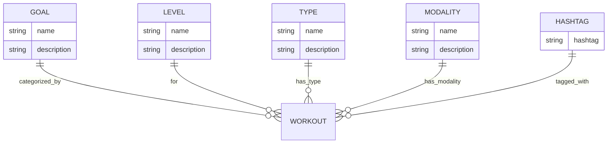
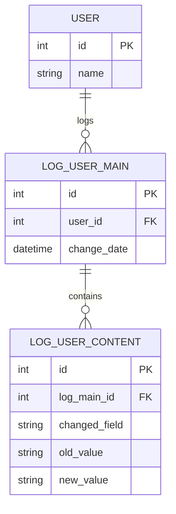
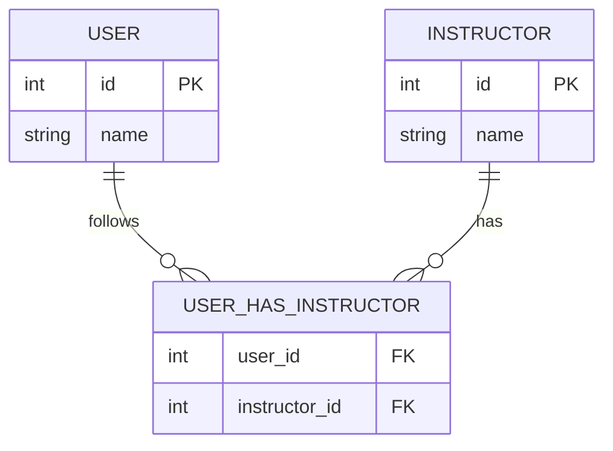
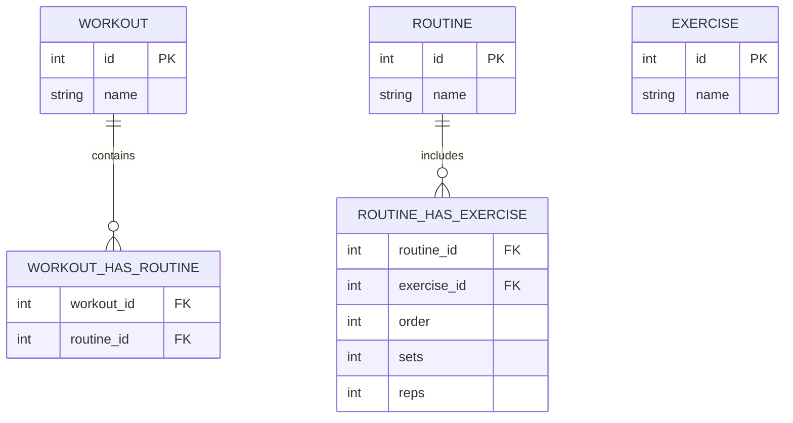

# EasyTrainer Database Documentation (MySQL)
This repository documents the structured MySQL database for the **EasyTrainer** platform — a system for managing fitness training, users, instructors, routines, and personalized programs.
**Key features:**
- Modular schema with normalized main and relationship tables
- Full logging/audit system for traceability and revision history
- Predefined views for reporting and dashboards
- Role-based access with four distinct user types (`admin`, `instructor`, `user`, `system`)
- Designed for data integrity and extensibility in both educational and production settings

## Documentation Structure
- [Main Tables](./docs/main_table.md)
- [Relationship Tables](./docs/relationship_tables.md)
- [Views](./docs/views.md)
- [Logs](./docs/logs.md)
- [Security & User Roles](./docs/security.md)
- [Populate / Example Data](./docs/populate.md)
    
---
## Database Overview
### Entity & Category Tables
Below are the core categorization tables used for tagging and filtering workouts, routines, and exercises:

---
### Logging & Audit Tables
All main tables are paired with logging tables for full auditability:

---
### Human Entities
Your database includes both "user" and "instructor" as human actors:

---
### Workout, Routine, Exercise Relationships
These structures allow for deep customization and granularity:

---
## Security Model
- **Four roles:**  
    `easytrainer_admin`, `easytrainer_instructor`, `easytrainer_user`, `easytrainer_system`
- [See detailed security & grants table here](./docs/security.md)

---
## Related Repositories
- [Backend (C#)](https://github.com/matheusfarnetani/EasyTrainer-Backend)
- [Python Microservice](https://github.com/matheusfarnetani/EasyTrainer-Holistic-Processor)
- [Frontend (Flutter)](https://github.com/matheusfarnetani/EasyTrainer)
